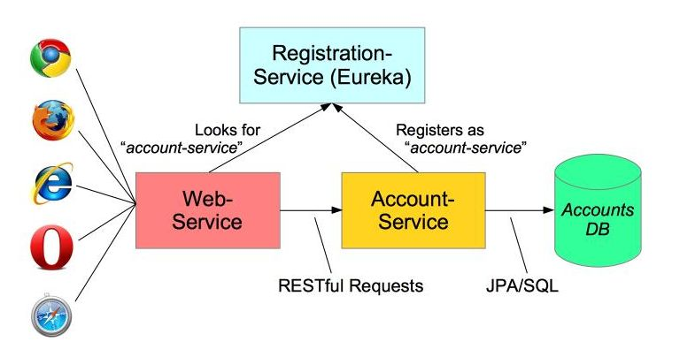

# Microservices registration/discovery demo (using Eureka and Consul)

This demo project is based on the [Microservices Blog](https://spring.io/admin/blog/2181-microservices-with-spring) on the spring.io website.

## Service Registration/Discovery server

Eureka or Consul could be used for the service discovery, if you don't have those servers running somewhere then you may run them locally:

### Eureka
Eureka could started simply by building and running the eureka-service application (eureka-service module of this project), 
its web UI could be accessed [http://localhost:1111](http://localhost:1111) ;

### Consul
Consul should be downloaded from https://www.consul.io/downloads.html and then could be started using the command line:
`consul agent -dev -bind=127.0.0.1`
Its web UI could be accessed [http://localhost:8500/ui](http://localhost:8500/ui).

## Build the project

 1. In the project root directory, build the project using:
 `mvn clean package -Peureka` if you intent to use Eureka or
 `mvn clean package -Pconsul` if you intent to use Consul as a service-discovery.

 1. Open a CMD windows (Windows) or three Terminal windows (MacOS, Linux) for each application and arrange so you can view them conveniently.
 In each window, change to the directory of each module (eureka-service, micro-service and client-service).

 1. To start the eureka-server (if using consul you may skip this step):  
 `java -jar eureka-service/target/eureka-service-1.0-SNAPSHOT.jar` 
 
 1. To start the micro-service :  
  `java -jar micro-service/target/micro-service-1.0-SNAPSHOT.jar`
   
 1. To start the client-server (accounts service):  
  `java -jar client-service/target/web-server-1.0-SNAPSHOT.jar`
   
 1. In your favorite browser open the same two links: [http://localhost:1111](http://localhost:1111) and [http://localhost:3333](http://localhost:3333)

You should see servers being registered in the log output of the first (registration) window.
As you interact you should logging in the second and third windows.

 1. In a new window, run up a second account-server using HTTP port 2223:
     * `java -jar target/accounts-service-1.0-SNAPSHOT.jar --server.port=2223`
 1. Allow it to register itself
 1. Kill the first account-server and see the web-server switch to using the new account-server - no loss of service.

> NB. Service registration and un-registration could take a while till 15 minutes.
  
## Using Consul as service discovery

To use Consul instead Eureka we need to download consul from https://www.consul.io/downloads.html
and run the consul agent (service) using the following command:
`consul agent -dev -bind=127.0.0.1`

The UI should be available at the /ui path on the same port as the HTTP API. 
By default this is http://localhost:8500/ui

Then Consul's client namely micro-service and client-service should be rebuild with following dependency with consul support:

`<dependency>`
`   <groupId>org.springframework.cloud</groupId>`
`	<artifactId>spring-cloud-starter-consul-all</artifactId>`
`</dependency>`

Eureka support (`org.springframework.cloud:spring-cloud-starter-eureka-server`) should be disabled if the service is not intended to be used.
  
**NB. No code changes are required as spring provides a common interface (@EnableDiscoveryClient) for service discovery.**

## Cloud Foundry deployment

1. To deploy the registration-service (eureka-service) using the registration-service/manifest.yml:
`cd registration-service`
`cf push`
1. To deploy the micro-service (accounts-service) using the micro-service/manifest.yml: 
`cd micro-service`
`cf push`
1. To deploy the client-server (web-server) using the client-service/manifest.yml:
`cd client-service`
`cf push`

NB. Project's modules were deployed and tested in SD3:
http://eureka-service.cf.sd3.hospira.corp/
http://web-service.cf.sd3.hospira.corp/accounts/123456789 

For more information regarding CF deployment see: 
https://spring.io/blog/2015/01/20/microservice-registration-and-discovery-with-spring-cloud-and-netflix-s-eureka
https://github.com/joshlong/service-registration-and-discovery
https://github.com/spring-cloud/spring-cloud-netflix/issues/102

You may find it easier to view the different applications by running them from a command line since you can place the three windows side-by-side and watch their log output

To do this, open three CMD windows (Windows) or three Terminal windows (MacOS, Linux) and arrange so you can view them conveniently.

## Using an IDE

You can run the system in your IDE by running the three servers in order: _RegistrationService_, _MicroService_ and _WebService_.

As discussed in the Blog, open the Eureka dashboard [http://localhost:1111](http://localhost:1111) in your browser to see that the `MICRO-SERVICE` and `WEB-SERVICE` applications have registered. 
Or run Consul  
 
Next open the Demo Home Page [http://localhost:3333](http://localhost:3333) in and click one of the demo links.

The `localhost:3333` web-site is being handled by a Spring MVC Controller in the _WebService_ application, but you should also see logging output from _AccountsService_ showing requests for Account data.